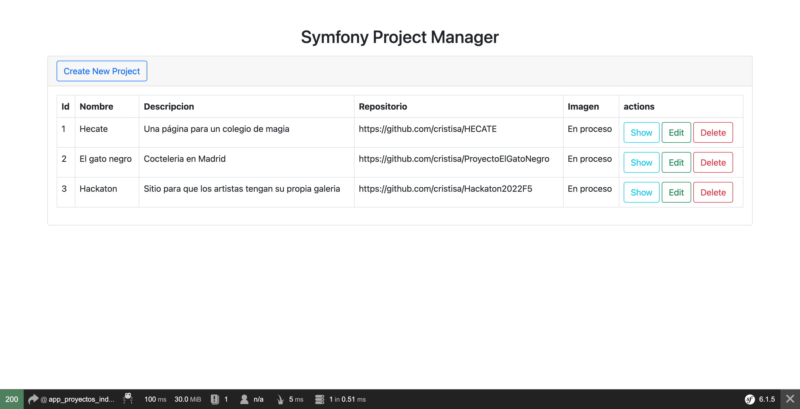
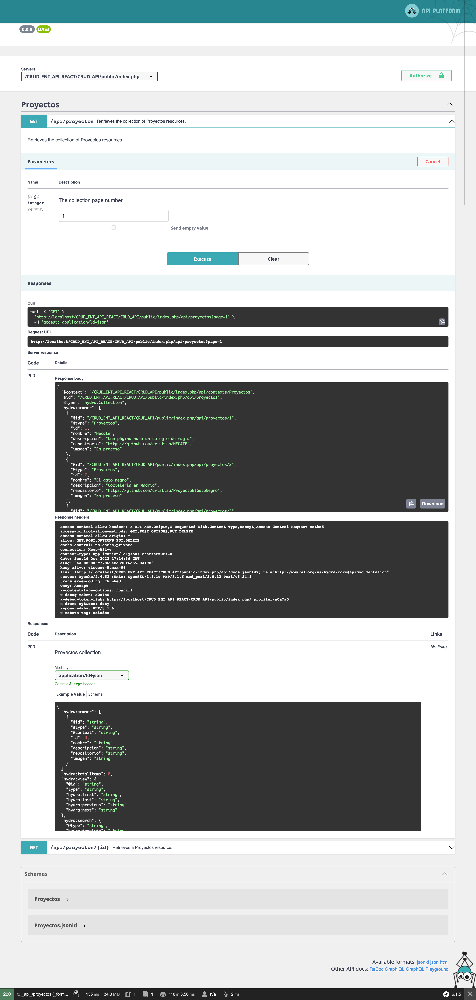
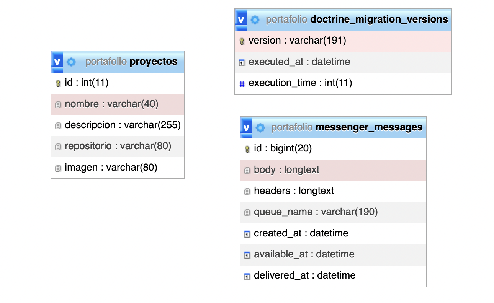

# Mi portafolio parte de Backend, se implementó un API con los proyectos disponibles en mi repositorio:

## CRUD:

## API:

## !🔌 Instala dependencias:
______ 
### `Tener instalado PHP!`
### `composer install`
### `composer require api`
### `composer require webonyx/graphql-php`

## Modelo Relacional:

### `Habría que cambiar la bd en .env para que se conecte a vuestra base de datos local.`
### `Ejecutar un php bin/console doctrine:schema:update --force --env dev para que actualice la base de datos.`
### `Guardalo dentro de la carpeta htdocs en XAMPP.`
### `Inicia el Servidor y MariaDB.`

Y disfruta 	
:tada:

## Stack:

- Bootstrap    
- JSON
- Api Plataform
- Graphql
- PHP
- Symfony Cli 5.4
- XAMPP (MariaDB, Apache)
